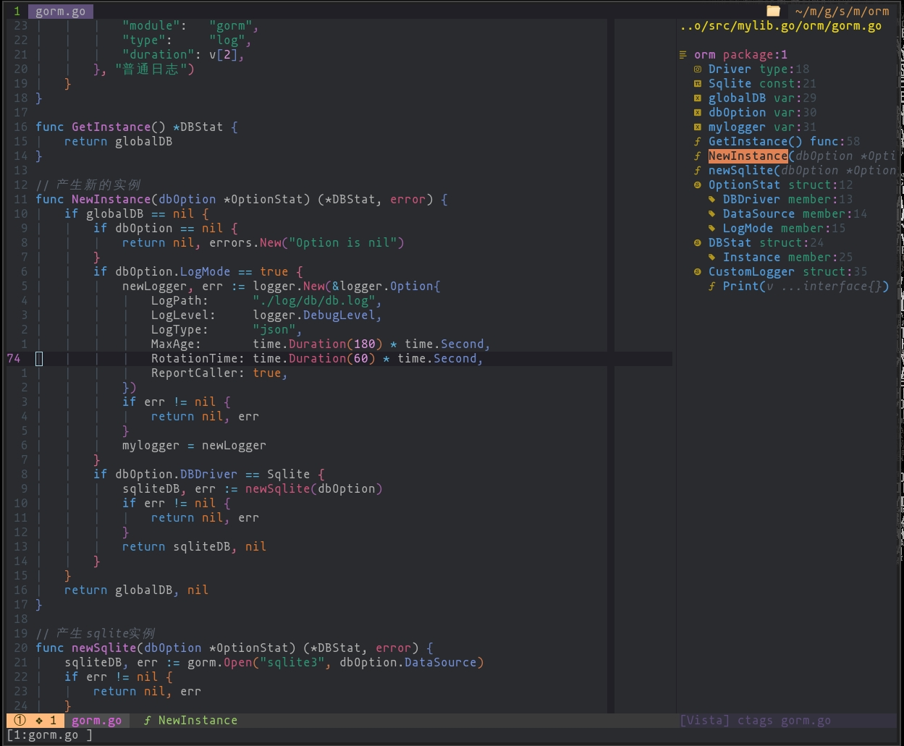

<!-- TOC GFM -->

- [介绍](#介绍)
- [快速开始](#快速开始)
- [安装后,您需要](#安装后您需要)
- [语言支持](#语言支持)
    + [Bash](#bash)
    + [Golang](#golang)
    + [Pythoon](#pythoon)
    + [Rust](#rust)

<!-- /TOC -->

### 介绍
这是我的vim配置, 它`fock`于`@theniceboy`.<br/>



### 快速开始
```bash
mv ~/.config/nvim ~/.config/nvim.bak
git clone --depth 1 https://github.com/Wjinlei/nvim.git ~/.config/nvim
```
### 安装后,您需要
- [ ] Python安装`pynvim` `ueberzug`(pip)
- [ ] 安装NodeJS`nodejs`
- [ ] NodeJS安装`neovim`(npm)
- [ ] 安装`ctags`
- [ ] 安装`ripgrep`
- [ ] 安装`xclip`
- [ ] 安装`nerd-fonts`(可选)
- [ ] 配置`python`路径, 编辑`_machine_specific.vim`
- [ ] 执行`:checkhealth`(检测有无错误)

### 语言支持
#### Bash
- [ ] 安装`bash-lanuage-server`(npm)

#### Golang
- [ ] 执行`:GoInstallBinary`
- [ ] 安装`Delve`,执行`go get github.com/go-delve/delve/cmd/dlv`

#### Pythoon
- [ ] 安装`autopep8`(pip)
- [ ] 安装`pylint`(pip)
- [ ] 安装`debugpy`(pip)

#### Rust
- [ ] 安装`rustup component add rls rust-analysis rust-src`
